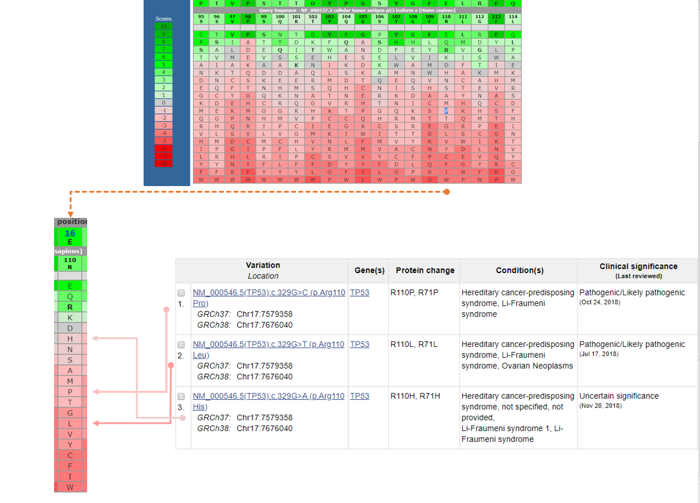
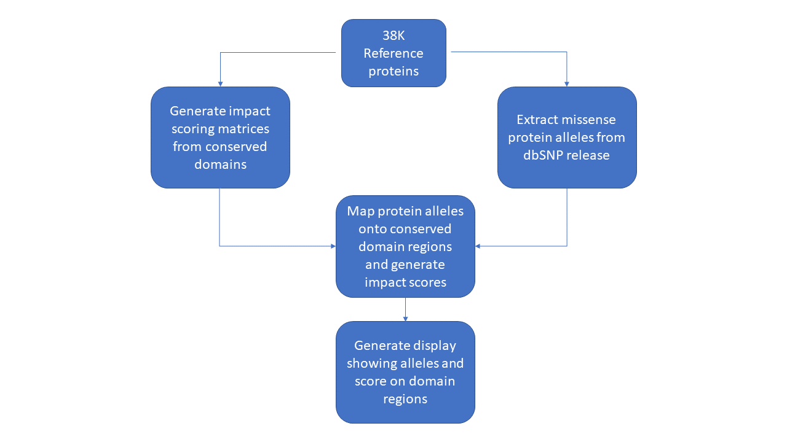

 


## Motivation
There are over 8 million human missense protein variations in dbSNP. These are the changes that may affect protein structure and function. However fewer than 2% of these changes have known human phenotypes. Predicting the potential impact of these uncharacterized variants is an important for bettier understanding of genetic influences on human health and disease.

## Project goal
This project aims to produce a pipeline for calculating a protein variant impact score for missense variants in human proteins that map to conserved domains. The impact score is based on substitution scores from Position Specific Score Matrices (PSSMs) from NCBI's conserved domain database. Substitutions with  negative impact scores are those least tolerated based on conservation and are therefore most likely to disrupt the structure and function of the protein. The ultimate goal is to predict the likelihood of a pathogenic phenotype for a particular variant based on the impact score.  Similar software exists such as PolyPhen-2 (http://genetics.bwh.harvard.edu/pph2/) and SIFT (https://sift.bii.a-star.edu.sg/), but niether of these methods takes advantage of the information on conserved amino acids available for NCBI's Conserved Domain database.
## Diagram of the Concept

Known pathogenic changes in the TP53 protein show up with negative scores (shaded red) in the PSSM.


## Outline of Method
We started with a file with 38,299 gi numbers for representative human RefSeq proteins and matched these to 38,277 current RefSeq accessions in the NCBI ID database and mapped scores from missense variants to the conserved domains of the protein. The display will highlight the predicted impact on the protein.




## Software
### Python Applications
**snp_info.py** a python class that gets all missense snps, frequency data from GnomAD_exome, phenotype compatible with Hadoop cluster.

 **Input** compressed (bzip2) json files from the [dbSNP FTP site](https://ftp.ncbi.nlm.nih.gov/snp/latest_release/JSON/)S

 **Sample commandline:**

 ```
 python snp_info.py -r hadoop hdfs:///user/wangq2/r69_json -o hdfs:///user/zhahua/missense_b153 --no-output --jobconf  mapreduce.job.name=get.missense --jobconf mapreduce.job.reduces=100 --jobconf mapreduce.job.queuename=prod.dbsnp -c mrjob.conf
 ```
**pssm_var.py** uses snp_info.py class to combine scores from PSSM data with snp_info

**Sample commandlines**


File mode
```
python pssm_var.py -f missense_snp_json_file.gz
```
Single SNP mode
```
python pssm_var.py -r rs429358
```
Sample output
```
{'snp_id': '429358', 'pssm': [{'NP_001289619': [{'pssmid': 'pfam01442', 'residues': [{'resi': 130, 'pline': 45, 'scores': {'A': -2, 'C': -3, 'D': -5, 'E': 2, 'F': -7, 'G': -1, 'H': -5, 'I': -5, 'K': 4, 'L': -2, 'M': -5, 'N': -3, 'P': -6, 'Q': 0, 'R': 5, 'S': -2, 'T': 1, 'V': 1, 'W': -7, 'Y': -6}}]}]}, {'NP_000032': [{'pssmid': 'pfam01442', 'residues': [{'resi': 130, 'pline': 45, 'scores': {'A': -2, 'C': -3, 'D': -5, 'E': 2, 'F': -7, 'G': -1, 'H': -5, 'I': -5, 'K': 4, 'L': -2, 'M': -5, 'N': -3, 'P': -6, 'Q': 0, 'R': 5, 'S': -2, 'T': 1, 'V': 1, 'W': -7, 'Y': -6}}]}]}, {'NP_001289620': [{'pssmid': 'pfam01442', 'residues': [{'resi': 130, 'pline': 45, 'scores': {'A': -2, 'C': -3, 'D': -5, 'E': 2, 'F': -7, 'G': -1, 'H': -5, 'I': -5, 'K': 4, 'L': -2, 'M': -5, 'N': -3, 'P': -6, 'Q': 0, 'R': 5, 'S': -2, 'T': 1, 'V': 1, 'W': -7, 'Y': -6}}]}]}, {'NP_001289617': [{'pssmid': 'pfam01442', 'residues': [{'resi': 156, 'pline': 45, 'scores': {'A': -2, 'C': -3, 'D': -5, 'E': 2, 'F': -7, 'G': -1, 'H': -5, 'I': -5, 'K': 4, 'L': -2, 'M': -5, 'N': -3, 'P': -6, 'Q': 0, 'R': 5, 'S': -2, 'T': 1, 'V': 1, 'W': -7, 'Y': -6}}]}]}, {'NP_001289618': [{'pssmid': 'pfam01442', 'residues': [{'resi': 130, 'pline': 45, 'scores': {'A': -2, 'C': -3, 'D': -5, 'E': 2, 'F': -7, 'G': -1, 'H': -5, 'I': -5, 'K': 4, 'L': -2, 'M': -5, 'N': -3, 'P': -6, 'Q': 0, 'R': 5, 'S': -2, 'T': 1, 'V': 1, 'W': -7, 'Y': -6}}]}]}], 'clin_sig': {'C': {'pathogenic', 'other', 'association'}}, 'freq': [{'C': (5135, 31228)}], 'protein_info': {('C', 'R', 130, 'NP_001289619.1'), ('C', 'R', 130, 'NP_000032.1'), ('C', 'R', 130, 'NP_001289620.1'), ('C', 'R', 156, 'NP_001289617.1'), ('C', 'R', 130, 'NP_001289618.1')}}
```

## C++ NCBI Toolkit applications
**getpssmforgipos** outputs PSSM json object for proteins
**Input** Protein identifiers (gi numbers). Requires access to internal NCBI CGI to get PSSM information.

**Sample commandline:**
```
getpssmforgipos gi optional_resi_pos

getpssmforgipos 4557325

```

**Sample output**


## Dependencies
* Python 3.6
* NCBI C++ toolkit

## Planned Features

## People
* Hua Zhang NCBI/IEB
* Peter Cooper NCBI/IEB
* Sema Kachalo NCBI/IEB
* Rich McVeigh NCBI/IEB
* Jialin (Charlie) Xiang NCBI/IEB
* Jiyao Wang NCBI/IEB

